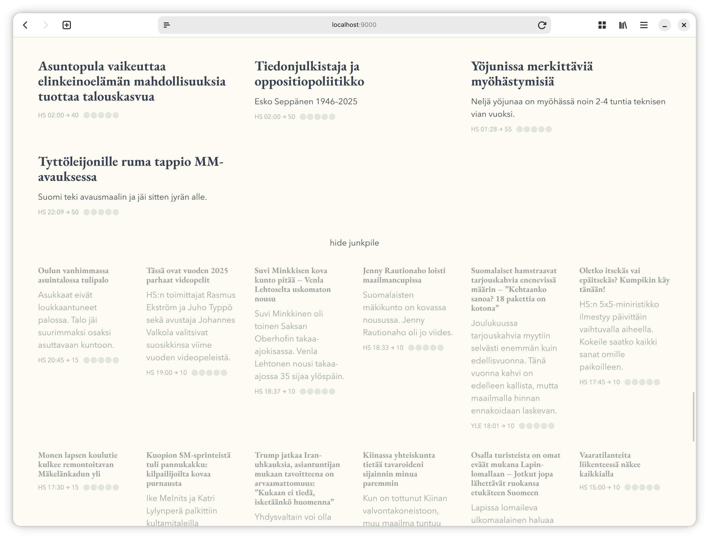
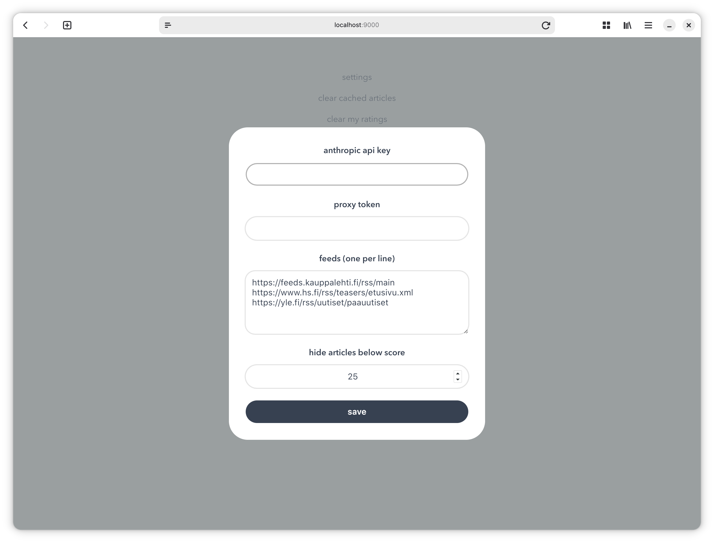

News Aggregator Front Page
==========================

News RSS is a client-side web app to fetch news article links from
multiple RSS feeds, filter and score them using using AI/LLM and
dynamically lay out a web page resembling a newspaper front page.

The app learns over time which news the user is interested in and which
not. Articles can be rated by the user, record of which persists in
local storage and is rendered as few-shot examples in the LLM prompt to
affect subsequent article filtering and scoring. There is no backend.
There is no state apart from local storage in the browser.

Articles in order of recency, size scaled by score:


Low score articles behind a toggle, hidden by default:


Initial configuration:


## Getting Started

You need an Anthropic API key from <https://platform.claude.com/settings/keys>

1. Start the local proxy server

   ```bash
   make run-proxy
   ```

2. Start the web app

   ```bash
   make run
   ```

3. Open <http://localhost:8000/?proxy-local=1>

See `Makefile` and `index.js` if something doesn't work ;–)

## Tradeoffs

* Articles are rated 1–5 by the user, which is mapped to scores 10, 30,
  50, 70 and 90, with the full range being 0–100. A simpler alternative
  would be upvote/downvote, which could under the hood do +20/-20
  against the score from the LLM. The former gives faster convergence,
  the latter a lighter UX for rating.

* After clicking a rating, the user is asked for a reason. For a lighter
  UX, you could skip that step. Consider a news article about a popular
  musician going to drug rehab. A user hits a rating, is it due to
  "music", "celebrity gossip" or "drugs"? The LLM will simply guess if a
  reason is not provided. It will still converge given more articles and
  ratings, but a specific reason will make it converge faster.
