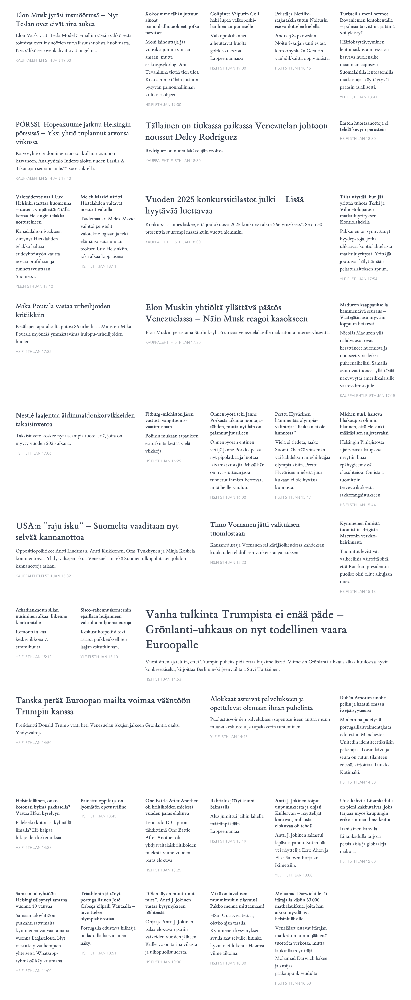

News Aggregator Front Page
==========================

News RSS is a client-side web app to fetch news article links from
multiple RSS feeds, filter and score them using using AI/LLM and
dynamically lay out a web page resembling a newspaper front page.

The app learns over time which news the user is interested in and which
not. Articles can be voted up or down by the user, record of which
persists in local storage and is rendered as few-shot examples in the
LLM prompt to affect subsequent article filtering and scoring. There is
no backend. There is no state apart from local storage in the browser.

## Getting Started

TODO/WIP
